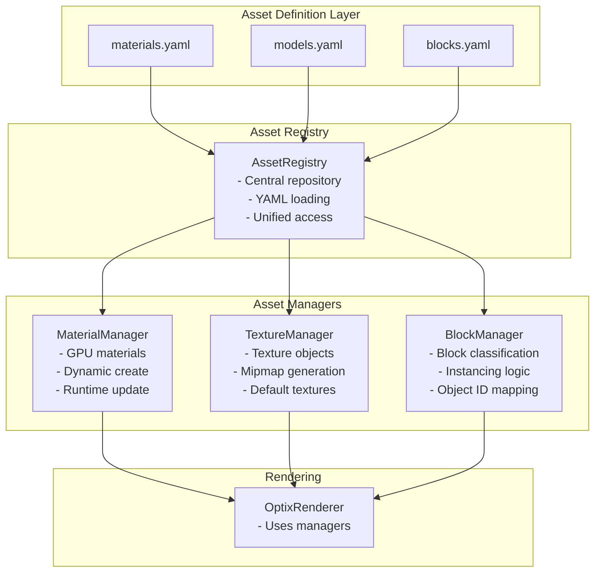

# Asset Management System - Complete Guide

## Overview

The asset management system provides a centralized, maintainable architecture for managing materials, textures, models, and blocks in the voxel path tracing engine. This system supports both YAML-based configuration and hardcoded fallbacks, with dynamic runtime capabilities for material updates and creation.

## System Architecture



## Core Components

### 1. AssetRegistry (Singleton)
**Location:** `renderer/assets/AssetRegistry.h/cpp`

The central repository for all asset definitions, providing a single source of truth for material, model, and block metadata.

**Key Features:**
- Loads asset definitions from YAML files with hardcoded fallback
- Maintains mappings between IDs and definitions
- Provides type-safe lookup functions
- Handles asset validation and error reporting

**API:**
```cpp
AssetRegistry& Get();  // Singleton access
bool loadFromYAML(const std::string& assetDirectory = "data/assets");
const MaterialDefinition* getMaterial(const std::string& id);
const ModelDefinition* getModel(const std::string& id);
const BlockDefinition* getBlock(int blockType);
const BlockDefinition* getBlockById(int id);
```

### 2. BlockManager (Singleton)
**Location:** `renderer/assets/BlockManager.h/cpp`

Centralizes all block classification logic that was previously scattered in inline helper functions. Handles block type classification, instancing decisions, and object ID mapping.

**Key Features:**
- Dynamic initialization from AssetRegistry data
- Block type classification (instanced vs uninstanced)
- Object ID to Block ID mapping
- Integration with YAML-based block definitions
- Advanced block queries (models, materials, emissive properties)

**API:**
```cpp
BlockManager& Get();
bool initialize();

// Block classification
bool isInstancedBlockType(unsigned int blockId);
bool isUninstancedBlockType(unsigned int blockId);
bool isTransparentBlockType(unsigned int blockId);
bool isBaseLightBlockType(unsigned int blockId);

// Counts and ranges
unsigned int getNumInstancedBlockTypes();
unsigned int getNumUninstancedBlockTypes();
unsigned int getInstancedObjectIdBegin();

// Object/Block ID mapping
unsigned int objectIdToBlockId(unsigned int objectId);
unsigned int blockIdToObjectId(unsigned int blockId);

// Advanced queries
bool hasModel(unsigned int blockId);
bool isEmissive(unsigned int blockId);
const std::string* getModelName(unsigned int blockId);
```

### 3. MaterialManager (Singleton)
**Location:** `renderer/assets/MaterialManager.h/cpp`

Manages GPU materials with support for dynamic creation, updates, and destruction.

**Key Features:**
- Creates GPU materials from AssetRegistry definitions
- Dynamic material slots with efficient memory management
- Runtime material parameter updates
- Material indexing for blocks and entities
- Automatic GPU synchronization

**API:**
```cpp
MaterialManager& Get();
bool initialize();
MaterialParameter* getGPUMaterialsPointer();

// Material access
unsigned int getMaterialIndexForBlock(int blockType);
unsigned int getMaterialIndexForObjectId(unsigned int objectId);

// Dynamic materials
unsigned int createDynamicMaterial(const MaterialProperties& props);
bool updateDynamicMaterial(unsigned int dynamicId, const MaterialProperties& props);
void destroyDynamicMaterial(unsigned int dynamicId);

// Update existing materials
bool updateMaterial(const std::string& materialId);
```

### 4. TextureManager
**Location:** `renderer/assets/TextureManager.cu/h`

Centralized texture loading and management with caching and mipmap generation.

**Key Features:**
- Texture loading from disk with format support
- Automatic mipmap generation for power-of-two textures
- Default texture creation (white, normal, black)
- Texture caching to prevent duplicates
- CUDA texture object management

## YAML Asset Configuration

### File Structure
All asset definitions are stored in `data/assets/`:
- `materials.yaml` - Material definitions
- `models.yaml` - 3D model definitions
- `blocks.yaml` - Block type definitions (generated enum boundary)

### Block Definition Format

```yaml
blocks:
  - id: 13                          # Block ID (matches BlockType enum)
    name: "Test1"                   # Display name
    type: BlockTypeTest1            # Enum type name
    material: test1                 # Material ID reference
    model: test_plane               # Model ID reference (optional)
    is_instanced: true             # Uses instancing system
    is_transparent: false          # Transparent rendering
    is_base_light: false           # Light base block
    is_emissive: false             # Emits light
```

**Important:** Block ID 13 (Test1) marks the boundary between uninstanced (0-12) and instanced (13+) blocks.

### Material Definition Format

```yaml
materials:
  - id: "sand"                      # Unique material identifier
    name: "Sand Material"           # Display name
    textures:                       # Texture paths (optional)
      albedo: "textures/rocky_trail_albedo.png"
      normal: "textures/rocky_trail_normal.png"
      roughness: "textures/rocky_trail_rough.png"
      metallic: "textures/metal.png"
      emissive: "textures/glow.png"
    properties:                     # Material properties
      albedo: [1.0, 1.0, 1.0]      # RGB values (0-1)
      roughness: 0.8               # 0=smooth, 1=rough
      metallic: 0.0                # 0=dielectric, 1=metal
      uv_scale: 2.5                # Texture coordinate scale
      translucency: 0.0            # 0=opaque, 1=translucent
      use_world_grid_uv: true      # Use world-space UVs
      is_emissive: false           # Emissive material
      emissive_radiance: [0,0,0]   # Emission color/intensity
```

### Model Definition Format

```yaml
models:
  - id: "test_plane"               # Unique model identifier
    name: "Test Plane Model"       # Display name
    file: "models/test_plane.obj"  # Path to model file
    type: "instanced"              # "instanced" or "entity"
    block_type: 13                 # Associated block type ID
    has_animation: false           # Has skeletal animation
```

## Initialization Sequence

1. **AssetRegistry::loadFromYAML()** - Load all asset definitions
2. **TextureManager::initialize()** - Load required textures
3. **MaterialManager::initialize()** - Create GPU materials from definitions
4. **BlockManager::initialize()** - Initialize block classification from AssetRegistry
5. **OptixRenderer** uses managers to access assets

## Runtime Material Updates

### Basic Material Update
```cpp
auto& materialManager = Assets::MaterialManager::Get();

// Update existing material properties
bool success = materialManager.updateMaterial("torch");
```

### Dynamic Material Creation
```cpp
// Create new material at runtime
MaterialProperties props;
props.albedo = Float3(0.8f, 0.2f, 0.2f);
props.roughness = 0.5f;
props.metallic = 0.8f;
props.isEmissive = true;
props.emissiveRadiance = Float3(10.0f, 5.0f, 2.0f);

unsigned int dynamicId = materialManager.createDynamicMaterial(props);
```

### Animated Materials
```cpp
// Animate material over time
float time = getCurrentTime();
MaterialProperties animatedProps;
animatedProps.albedo = Float3(
    0.5f + 0.5f * sin(time),
    0.5f + 0.5f * sin(time + 2.0f),
    0.5f + 0.5f * sin(time + 4.0f)
);
animatedProps.roughness = 0.5f + 0.3f * sin(time * 2.0f);

materialManager.updateDynamicMaterial(dynamicId, animatedProps);
```

## Block Classification System

The BlockManager provides centralized block classification replacing previous inline functions:

### Legacy vs New Approach

**Before (scattered inline functions):**
```cpp
// In BlockType.h (auto-generated)
inline bool IsInstancedBlockType(unsigned int blockId) {
    return blockId >= 13;
}
inline unsigned int GetNumInstancedBlockTypes() {
    return BlockTypeNum - 13;
}
```

**After (centralized BlockManager):**
```cpp
// Dynamic initialization from YAML data
bool isInstanced = Assets::BlockManager::Get().isInstancedBlockType(blockId);
unsigned int count = Assets::BlockManager::Get().getNumInstancedBlockTypes();
```

### Block ID Mapping
```cpp
auto& blockManager = Assets::BlockManager::Get();

// Convert between object IDs and block IDs
unsigned int blockId = blockManager.objectIdToBlockId(objectId);
unsigned int objectId = blockManager.blockIdToObjectId(blockId);

// Get ID ranges
unsigned int instancedBegin = blockManager.getInstancedObjectIdBegin();
unsigned int instancedEnd = blockManager.getInstancedObjectIdEnd();
```

## Integration with Rendering

The managers integrate seamlessly with the OptixRenderer:

```cpp
// In OptixRenderer initialization
m_systemParameter.materialParameters = MaterialManager::Get().getGPUMaterialsPointer();

// Material indexing for SBT records
unsigned int matIndex = MaterialManager::Get().getMaterialIndexForBlock(blockType);

// Block classification for rendering decisions
bool isInstanced = BlockManager::Get().isInstancedBlockType(blockId);
```

## Code Generation

Block types are auto-generated from YAML configuration:

**Generator:** `scripts/generate_block_types.py`
**Output:** `generated/voxelengine/BlockType.h`

The generator creates a minimal enum-only header:
```cpp
#pragma once
// THIS FILE IS AUTO-GENERATED FROM data/assets/blocks.yaml

enum BlockType
{
    BlockTypeEmpty,      // ID: 0 - Empty
    BlockTypeSand,       // ID: 1 - Sand
    // ... more entries ...
    BlockTypeTestLight,  // ID: 16 - TestLight

    BlockTypeNum = 17,
};
```

## Performance Considerations

1. **Texture Deduplication**: TextureManager caches loaded textures
2. **Material Slots**: Pre-allocated slots prevent GPU memory reallocation
3. **Block Classification**: Cached results in BlockManager avoid repeated YAML lookups
4. **GPU Synchronization**: Materials updated in batches before rendering
5. **Memory Layout**: Optimized GPU material buffer layout

## Error Handling and Fallbacks

- **Missing YAML files**: Falls back to hardcoded asset definitions
- **Missing textures**: Uses default white/normal/black textures
- **Invalid references**: Logs errors and uses fallback materials
- **Dynamic material exhaustion**: Returns error codes for proper handling

## Migration from Legacy System

### For Renderer Code
**Before:**
```cpp
// Materials created inline
MaterialParameter param;
param.textureAlbedo = textureManager.GetTexture("texture.png");
m_materialParameters.push_back(param);

// Block classification with inline functions
if (IsInstancedBlockType(blockId)) { ... }
```

**After:**
```cpp
// Materials from MaterialManager
m_systemParameter.materialParameters = MaterialManager::Get().getGPUMaterialsPointer();
unsigned int matIndex = MaterialManager::Get().getMaterialIndexForBlock(blockType);

// Block classification through BlockManager
if (BlockManager::Get().isInstancedBlockType(blockId)) { ... }
```

### For Asset Updates
**Before:** Edit hardcoded arrays in source files
**After:** Edit YAML files in `data/assets/` and rebuild

## Debugging and Troubleshooting

### Common Issues

1. **Material not loading**: Check YAML syntax and file paths
2. **Black textures**: Verify texture files exist and are readable
3. **Incorrect block classification**: Check `blocks.yaml` configuration
4. **Memory leaks**: Ensure dynamic materials are properly destroyed

### Debug Information
Enable verbose logging:
```cpp
MaterialManager::Get().setVerboseLogging(true);
```

Check asset loading status:
```cpp
bool loaded = AssetRegistry::Get().isLoaded();
const auto& materials = AssetRegistry::Get().getAllMaterials();
```

## Future Enhancements

1. **Hot Reload**: Watch YAML files for changes and reload automatically
2. **Asset Streaming**: Load/unload assets on demand for large scenes
3. **LOD Support**: Multiple detail levels per model with automatic selection
4. **Material Templates**: Inheritance system for material definitions
5. **Advanced Validation**: Check texture dimensions and material property ranges
6. **Performance Profiling**: Built-in timing for asset operations

## Best Practices

### Asset Organization
- Use descriptive, consistent naming for asset IDs
- Group related assets (e.g., `stone_`, `wood_` prefixes)
- Keep texture resolutions power-of-two for mipmapping
- Minimize unique texture count for performance

### Material Properties
- Start with default values and adjust incrementally
- Test materials under different lighting conditions
- Use `use_world_grid_uv: true` for terrain that should tile seamlessly
- Balance emissive intensity to avoid overexposure

### Development Workflow
1. Define assets in YAML files
2. Test with hardcoded fallbacks during development
3. Use dynamic materials for runtime effects
4. Profile asset loading and GPU memory usage
5. Validate assets before committing changes

This comprehensive asset management system provides a robust foundation for the voxel path tracing engine with clean separation of concerns, dynamic capabilities, and excellent maintainability.