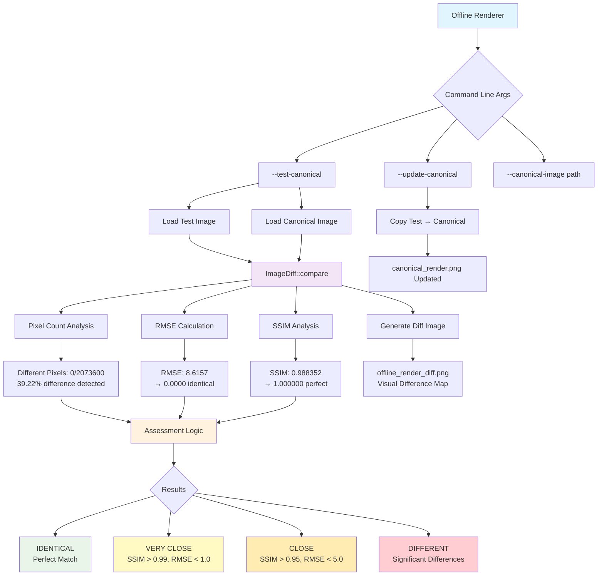

# Image Diffing System Documentation

## Overview

The image diffing system provides comprehensive canonical image testing for the offline renderer, enabling regression detection and quality control through multiple comparison algorithms.

## System Architecture



## Features

### Three Image Comparison Algorithms

1. **Simple Pixel Difference**: Counts pixels exceeding threshold (0.01)
2. **RMSE (Root Mean Square Error)**: Mathematical pixel deviation analysis
3. **SSIM (Structural Similarity Index)**: Advanced perceptual similarity measure

### Command Line Interface

```bash
# Compare output with canonical reference image
./voxelgame_offline.exe --test-canonical

# Update the canonical reference image from current render
./voxelgame_offline.exe --update-canonical

# Use custom canonical image path
./voxelgame_offline.exe --canonical-image path/to/reference.png

# Combine with other options
./voxelgame_offline.exe --scene scene_export.yaml --width 1920 --height 1080 --frames 1 --test-canonical
```

### Assessment Categories

- **🟢 IDENTICAL**: Perfect match (0 different pixels)
- **🟡 VERY CLOSE**: SSIM > 0.99 & RMSE < 1.0 (excellent match)
- **🟠 CLOSE**: SSIM > 0.95 & RMSE < 5.0 (good match)
- **🔴 DIFFERENT**: Significant differences detected

### Visual Diff Generation

The system automatically generates `offline_render_diff.png` - a visual difference map with 3x amplification for better visibility of subtle differences.

## Usage Examples

### Initial Setup
```bash
# First time: render and create canonical reference
./voxelgame_offline.exe --scene scene_export.yaml --update-canonical
```

### Regression Testing
```bash
# Test against canonical - detects any changes
./voxelgame_offline.exe --scene scene_export.yaml --test-canonical
```

### Example Output
```
=== Image Comparison Results ===
Different pixels: 0 / 2073600 (0.00%)
RMSE: 0.0000
SSIM: 1.000000
Assessment: IDENTICAL
Difference visualization saved to: offline_render_diff.png

Image matches canonical reference within acceptable tolerance.
```

## Implementation Files

- **`renderer/util/ImageDiff.h`** - Header with image comparison interfaces
- **`renderer/util/ImageDiff.cpp`** - Complete implementation with three diff algorithms
- **`mainOffline.cpp`** - Command line interface integration
- **`CMakeLists.txt`** - Build system integration

## Supported Formats

- PNG (recommended)
- JPG/JPEG
- TGA
- BMP

## Technical Details

### SSIM Implementation
- Converts images to grayscale using standard RGB→Y conversion (0.299R + 0.587G + 0.114B)
- Applies 3x3 Gaussian filtering for noise reduction
- Uses standard SSIM parameters (K1=0.01, K2=0.03, L=255)

### RMSE Calculation
- Computes per-channel squared differences
- Averages across all pixels and channels
- Returns square root of mean squared error

### Pixel Difference Analysis
- Uses configurable threshold (default: 0.01 on 0-1 scale)
- Counts pixels exceeding threshold in any channel
- Reports both absolute count and percentage

## Integration with Build System

The image diffing system is fully integrated into both the main `voxelgame` and `voxelgame_offline` targets, with proper STB library conflict resolution.